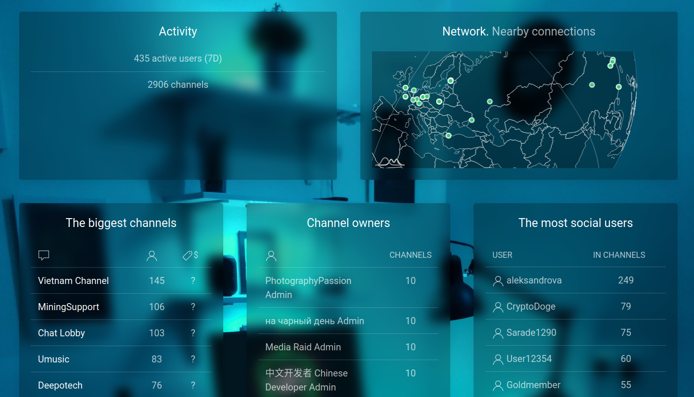

# umetrics

WEB3.0 channel catalog in Utopia Ecosystem 



build

```bash
go build
```

`templates` & `assets` must be placed in release directory.

copy `config.example.json` to `config.json`, then enter the parameters to connect to the Utopia client.

After launching, the synchronization process will start: channels, users, peers and so on.
